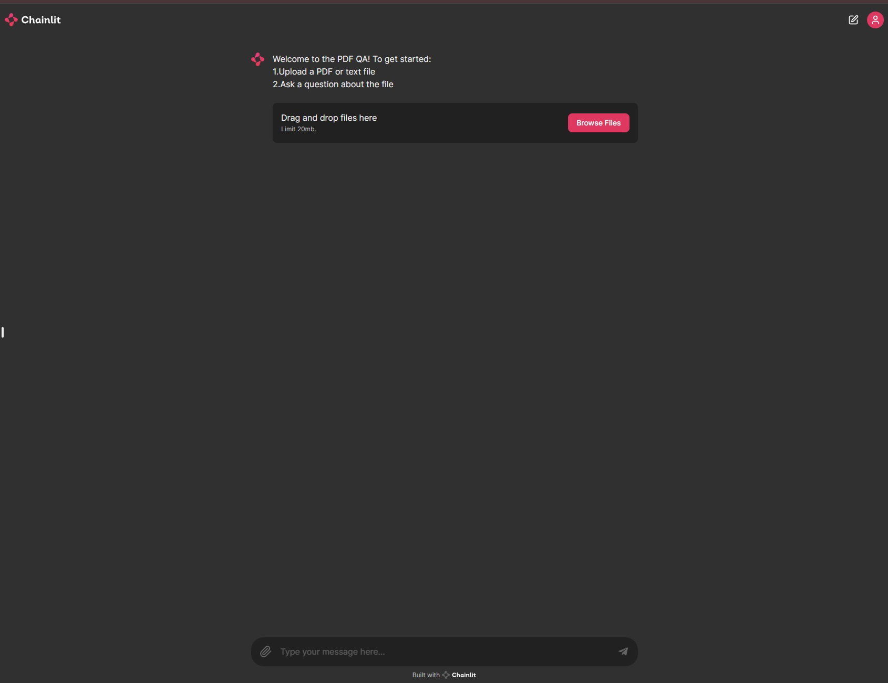
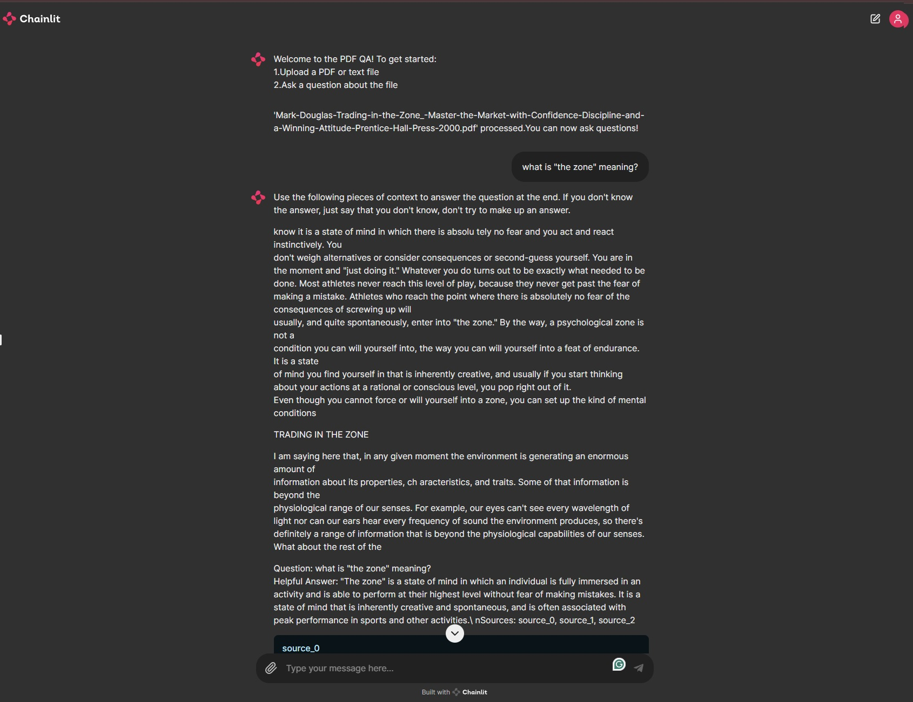

# Text Project-QA-with-PDF-files

This project showcases the construction and deployment of a Retrieval-Augmented Generation (RAG) chatbot using [Chainlit](https://github.com/Chainlit/chainlit.git) for the user interface. The deployment process involves [Google Colab](https://colab.google/) and [ngrok](https://ngrok.com/)


## Setup and Execution

1. **Clone the Repository**

    First, clone this repository

    ```bash
    git clone https://github.com/pipipip169/Text-Project-QA-with-PDF-files.git
    ```

2. **Open Google Colab**

    Open [Google Colab](https://colab.research.google.com/), upload and run the `Text_Project_QA_with_PDF_files.ipynb` file from this repository.




## Usage

1. **Upload a File**

    Start by uploading a PDF or text file when prompted.

2. **Ask Questions**

    Feel free to ask about any question within the uploaded file. The chatbot will process it and provide answers, citing relevant sources from the document uploaded.
